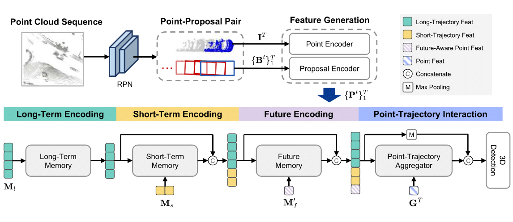

## PTT: Point-Trajectory Transformer for Efficient Temporal 3D Object Detection (CVPR2024)[\[paper\]](https://openaccess.thecvf.com/content/CVPR2024/html/Huang_PTT_Point-Trajectory_Transformer_for_Efficient_Temporal_3D_Object_Detection_CVPR_2024_paper.html)

**Authors**: [Kuan-Chih Huang](https://kuanchihhuang.github.io/), [Weijie Lyu](https://www.wlyu.me/), [Ming-Hsuan Yang](https://faculty.ucmerced.edu/mhyang/), [Yi-Hsuan Tsai](https://sites.google.com/site/yihsuantsai/).

## Introduction

Recent temporal LiDAR-based 3D object detectors achieve promising performance based on the two-stage proposal-based approach. They generate 3D box candidates from the first-stage dense detector followed by different temporal aggregation methods. However these approaches require per-frame objects or whole point clouds posing challenges related to memory bank utilization. Moreover point clouds and trajectory features are combined solely based on concatenation which may neglect effective interactions between them. In this paper we propose a point-trajectory transformer with long short-term memory for efficient temporal 3D object detection. To this end we only utilize point clouds of current-frame objects and their historical trajectories as input to minimize the memory bank storage requirement. Furthermore we introduce modules to encode trajectory features focusing on long short-term and future-aware perspectives and then effectively aggregate them with point cloud features

## Setup
This project is built on [OpenPCDet](https://github.com/open-mmlab/OpenPCDet). Please follow their instruction to install the packages and preprocess the Waymo dataset.

## Training
We first train the RPN model in the same way as MPPNet and MSF. Please follow their instructions to train CeterPoint (4 frames) model and get the prediction results of the training and val dataset.

The prediction results of train and val dataset will be saved in \
../output/waymo_models/centerpoint_4frames/default/eval/epoch_36/train/default/result.pkl,
../output/waymo_models/centerpoint_4frames/default/eval/epoch_36/val/default/result.pkl.

After that, train PTT with
```shell
# Single GPU
python train.py --cfg_file cfgs/waymo_models/ptt_32frames.yaml --batch_size  5  \
--set DATA_CONFIG.ROI_BOXES_PATH.train  ../output/waymo_models/centerpoint_4frames/default/eval/epoch_36/train/default/result.pkl \
 DATA_CONFIG.ROI_BOXES_PATH.test  ../output/waymo_models/centerpoint_4frames/default/eval/epoch_36/val/default/result.pkl
# Multiple GPUs
bash scripts/dist_train.sh ${NUM_GPUS} --cfg_file cfgs/waymo_models/ptt_32frames.yaml --batch_size  5  \
--set DATA_CONFIG.ROI_BOXES_PATH.train  ../output/waymo_models/centerpoint_4frames/default/eval/epoch_36/train/default/result.pkl \
 DATA_CONFIG.ROI_BOXES_PATH.test  ../output/waymo_models/centerpoint_4frames/default/eval/epoch_36/val/default/result.pkl
```

## Evaluation
```shell
# Single GPU
python test.py --cfg_file cfgs/waymo_models/ptt_32frames.yaml  --batch_size  1 \
--ckpt  ../output/waymo_models/ptt_32frames/default/ckpt/checkpoint_epoch_6.pth \
--set DATA_CONFIG.DATA_SPLIT.test val DATA_CONFIG.ROI_BOXES_PATH.train ../output/waymo_models/centerpoint_4frames/default/eval/epoch_36/train/default/result.pkl \
DATA_CONFIG.ROI_BOXES_PATH.test ../output/waymo_models/centerpoint_4frames/default/eval/epoch_36/val/default/result.pkl
```

## Log

The performance of PTT with 32 frames on Waymo valdation split are as follows. 

|         |  % Training | Car AP/APH | Ped AP/APH | Cyc AP/APH  | Log file |
|---------|:-:|--------|--------|--------|--------|
|  Level 1 | 100% |   83.53/83.05 | 86.13/83.42  |  78.55/77.85  | [Download](https://drive.google.com/file/d/18qlm1oJwwlac0l4n1j5A_E5Sojc79Wbu/view?usp=sharing)
|  Level 2 | 100% |   76.30/75.84 | 79.33/76.67  |  76.30/75.61  |


## Acknowlegment

Our codes are mainly based on [MPPNet](https://github.com/open-mmlab/OpenPCDet/blob/master/docs/guidelines_of_approaches/mppnet.md) and [MSF](https://github.com/skyhehe123/MSF). Thanks for their contributions!


### Citation
```
@inproceedings{huang2024ptt,
    author = {Kuan-Chih Huang and Weijie Lyu and Ming-Hsuan Yang and Yi-Hsuan Tsai},
    title = {PTT: Point-Trajectory Transformer for Efficient Temporal 3D Object Detection},
    booktitle = {CVPR},
    year = {2024}    
}
```
